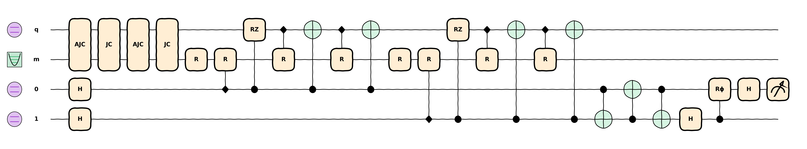

.. |PyPI - Version| image:: https://img.shields.io/pypi/v/hybridlane?logo=pypi
   :target: https://pypi.org/project/hybridlane/
.. |Docs| image:: https://img.shields.io/github/actions/workflow/status/pnnl/hybridlane/docs.yml?branch=main&logo=githubpages&label=docs
   :target: https://pnnl.github.io/hybridlane/
.. |PyPI Downloads| image:: https://static.pepy.tech/personalized-badge/hybridlane?period=total&units=INTERNATIONAL_SYSTEM&left_color=BLACK&right_color=GREEN&left_text=downloads
   :target: https://pepy.tech/projects/hybridlane/
.. |Build Status| image:: https://img.shields.io/github/actions/workflow/status/pnnl/hybridlane/release.yml
   :target: https://github.com/pnnl/hybridlane/actions/workflows/release.yml
.. |License| image:: https://img.shields.io/github/license/pnnl/hybridlane
   :target: LICENSE.txt

|PyPI - Version| |Docs| |PyPI Downloads| |Build Status| |License|

hybridlane
==========

**hybridlane** is a Python library for designing and manipulating **hybrid continuous-variable (CV) and discrete-variable (DV) quantum circuits** within the `PennyLane <https://pennylane.ai/>`_ ecosystem. It provides a frontend for expressing hybrid quantum algorithms, implementing the concepts from the paper Y. Liu *et al*, 2026 (`PRX Quantum 7, 010201 <https://doi.org/10.1103/4rf7-9tfx>`_).

----

✨ Why hybridlane?
--------------------

As quantum computing explores beyond traditional qubit-only models, `hybridlane` offers a powerful and intuitive framework for researchers and developers to:

*   **Design complex hybrid circuits effortlessly:** Seamlessly integrate qubits and qumodes in the same circuit.
*   **Describe large-scale circuits:** Define hybrid gate semantics independently of simulation, enabling fast description of wide and deep circuits with minimal memory.
*   **Leverage the PennyLane ecosystem:** Integrate with PennyLane's extensive tools for transformations, resource estimation, and device support.

----

🚀 Features
----------------

*   **📃 Hybrid Gate Semantics:** Precise, platform-independent definitions for hybrid gates, enabling rapid construction of large-scale quantum circuits.

*   **⚛️ Native Qumode Support:** Qumodes are treated as a fundamental wire type, with automatic type inference that simplifies circuit construction and enhances readability.

*   **🤝 PennyLane Compatibility:** A familiar interface for PennyLane users. Utilize existing PennyLane gates, build custom hybrid devices, write compilation passes, and perform resource estimation across mixed-variable systems.

*   **💻 Classical Simulation:** A built-in device that dispatches to `Bosonic Qiskit <https://github.com/C2QA/bosonic-qiskit>`_ for simulating small hybrid circuits.

*   **💾 OpenQASM-based IR:** An intermediate representation based on an extended OpenQASM, promoting interoperability and enabling advanced circuit manipulations.

----

⚙️ Installation
------------------

`hybridlane` is currently in **early preview**. We welcome your feedback on our `GitHub Issues <https://github.com/pnnl/hybridlane/issues>`_ page to help us improve.

Install the package from PyPI:

.. code-block:: bash

    pip install hybridlane

**Available Extras:**

*   ``[all]``: Installs all extra dependencies.

*   ``[bq]``: Installs support for the ``bosonicqiskit.hybrid`` simulation device.

*   ``[qscout]``: Installs support for the ``sandiaqscout.hybrid`` compilation device.

For detailed instructions, see the `Getting Started Guide <https://pnnl.github.io/hybridlane/getting-started.html>`_ in our documentation.

----

⚡ Quick Start
-----------------

.. code-block:: python

    import numpy as np
    import pennylane as qml
    import hybridlane as hqml

    # Create a bosonic qiskit simulator with a custom Fock truncation
    dev = qml.device("bosonicqiskit.hybrid", max_fock_level=8)

    # Define a hybrid circuit with familiar PennyLane syntax
    @qml.qnode(dev)
    def circuit(n):
        for j in range(n):
            qml.X(0)  # Wire `0` is inferred to be a qubit
            # Use hybrid CV-DV gates from hybridlane
            hqml.JC(np.pi / (2 * np.sqrt(j + 1)), np.pi / 2, [0, "m"])

        # Mix qubit and qumode observables
        return hqml.expval(hqml.N("m") @ qml.Z(0))

    # Execute the circuit
    expval = circuit(5)
    # array(5.)

    # Analyze its structure
    import hybridlane.sa as sa
    res = sa.analyze(circuit._tape)
    print(res)
    # StaticAnalysisResult(qumodes=Wires(['m']), qubits=Wires([0]), schemas=[...])

For more examples, explore our `Documentation <https://pnnl.github.io/hybridlane/>`_.

----

🗺️ Roadmap
-------------

`hybridlane` is under active development. Here are some of our future goals:

*   **Broader measurement support:** Including mid-circuit measurements and broader measurement capabilities.
*   **Algorithms and transformations:** Implementing popular algorithms and circuit transformations from research papers, including dynamic qumode allocation.
*   **Symbolic Hamiltonians:** Introducing support for symbolic bosonic Hamiltonians.
*   **Noisy simulation:** Supporting noisy simulations with Bosonic Qiskit.
*   **Pulse-level gates:** Allowing pulse-level gates and simulating them in Dynamiqs.
*   **Catalyst/QJIT support:** Integrating with PennyLane's `qjit` capabilities by developing a custom MLIR dialect.
*   **Community-driven features:** Incorporating features requested by the community during usage.

----

📚 Documentation
---------------------

For comprehensive information on `hybridlane`'s API, tutorials, and technical background, please visit our official `Documentation <https://pnnl.github.io/hybridlane/>`_.

----

❓ Support
-------------

For questions, bug reports, or feature requests, please open an issue on our `GitHub Issues page <https://github.com/pnnl/hybridlane/issues>`_.

----

Citing hybridlane
-------------------

If you use `hybridlane` in your research, please cite our work:

.. code-block::

    under preparation, check back soon :)

----

📜 License
-------------

This project is licensed under the BSD 2-Clause License - see the `LICENSE.txt <LICENSE.txt>`_ file for details.

----

🙏 Acknowledgements
----------------------

This project was supported by the U.S. Department of Energy, Office of Science, Advanced Scientific Computing Research program under contract number DE-FOA-0003265.

.. toctree::
    :maxdepth: 2
    :caption: Using Hybridlane
    :hidden:

    introduction
    getting-started
    static-analysis
    exporting-circuits

.. toctree::
    :maxdepth: 1
    :caption: API Reference
    :hidden:

    hqml <_autoapi/hybridlane/index>
    hqml.devices <_autoapi/hybridlane/devices/index>
    hqml.io <_autoapi/hybridlane/io/index>
    hqml.measurements <_autoapi/hybridlane/measurements/index>
    hqml.ops <_autoapi/hybridlane/ops/index>
    hqml.sa <_autoapi/hybridlane/sa/index>
    hqml.templates <_autoapi/hybridlane/templates/index>
    hqml.transforms <_autoapi/hybridlane/transforms/index>
..    _autoapi/hybridlane/util/index
